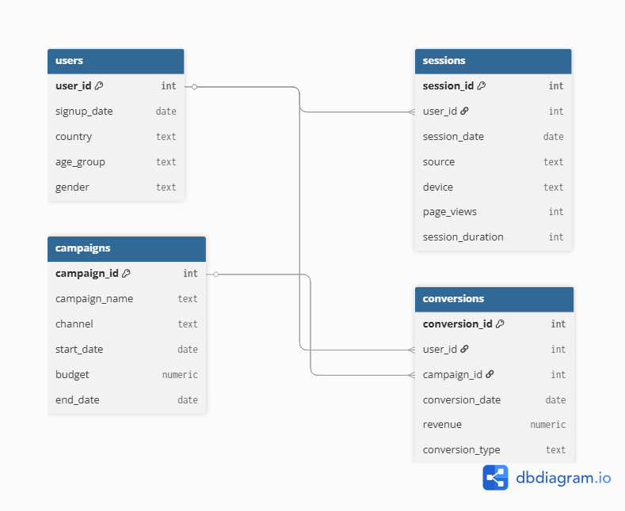

# Web Marketing Analysis

## 📌 Overview

This project analyzes marketing performance by combining user data, campaign information, sessions, and conversions. The goal is to identify which campaigns and channels drive the most value, understand user engagement patterns, and evaluate return on investment (ROI).

## 📊 Dataset

The dataset was synthetically generated using Python and exported into CSV files. Due to size limitations, only a **sample dataset** is included in this repository. You can regenerate the full dataset by running the provided Python script.

### Main tables:

   - users → Information about users (signup date, country, age group, gender).
   - sessions → Details of user sessions (device, source, page views, session duration).
   - campaigns → Campaign metadata (name, channel, budget, duration).
   - conversions → User conversions attributed to campaigns, with revenue and type.

### 📌 Original Data Source:
Synthetic data.

## 🛠️ Tools & Technologies

* PostgreSQL
* Python (for synthetic data generation)
* Power BI (dashboard & visualization)
* dbdiagram.io (for ERD design)

## ❓ Key Business Questions

1. Which marketing channels and campaigns bring the highest ROI?
2. What are the key demographics (age group, gender, country) that drive conversions?
3. How do user engagement metrics (page views, session duration) impact conversion likelihood?
4. Which campaigns are most effective at retaining users over time?
5. What is the revenue distribution across different campaign types and channels?

## 📂 Repository Structure

- docs/                  → ERD & raw dataset files
- images/                → screenshots of dashboards (Power BI) and query results (pgAdmin)
- sql/                   → database schema, load script, and analysis queries
- Analysis_resume.md     → All queries analysis used for this repository
- README.md              → project summary and instructions 

## 🔗 Relationships (ERD)
The ERD below illustrates the relationships between users, sessions, campaigns, and conversions.
*(ERD image generated via dbdiagram.io)*

## 🔄 How to Reproduce
- Create a PostgreSQL database:
      * In pgAdmin → right-click Databases → Create - Database → name it `web_marketing` (or any name you preffer).
- Schema & Data Import:
      * Run the schema script in [SCHEMA](sql/SCHEMA.sql) to create all tables and insert data.
- Sample queries:
      * Analytical SQL queries are available in [Analysis](sql/Analysis.sql).
      * These queries can be run in pgAdmin or connected directly to Power BI for visualization.

## 📈 Power BI Dashboard
The dashboard highlights some insights such as:
  - Users distribution, engagement, sessions and views ... [Activity Overview](images/activity_overview.png)
  - Campaigns performance ... [Campaigns](images/campaign_performance.png)
  - Demographics ... [Demographic](images/demographics.png)
  - Cohort ... [Cohort](images/retention_cohort.png)
  - Traffic source ... [Traffic](images/traffic_soruce.png)
  - Revenue, ROI, active users and more ... [Activity Overall](images/funnel_conversions.png)
